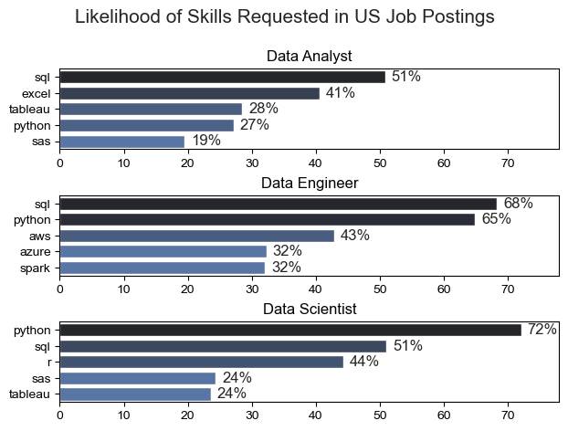
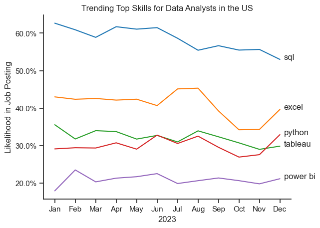
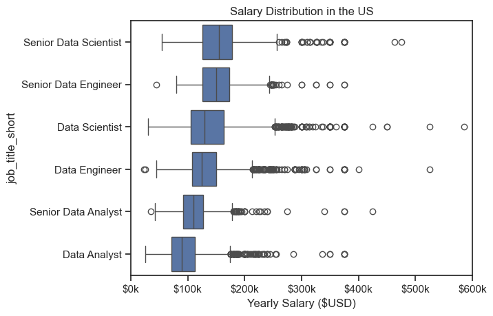

# Introduction

This project explores the current landscape of data-related jobs in the U.S., focusing on the most in-demand skills, salary trends, and the evolving requirements for top data roles. By analyzing job postings and salary data, the project provides actionable insights for aspiring and current data professionals.

# Overview

The analysis covers three main areas:
- **Skill Demand:** Identifies the most sought-after skills for Data Analysts, Data Engineers, and Data Scientists, highlighting the top five skills for each role.
- **Skill Trends:** Examines how the demand for key skills, especially for Data Analysts, has changed over time.
- **Salary Insights:** Investigates salary distributions across major data roles and pinpoints the highest-paying and most in-demand skills for Data Analysts.

Visualizations and detailed insights help readers understand which skills to prioritize and how different roles compare in terms of compensation and requirements.

# Tools Used

- **Python**: Main programming language for data analysis and visualization.
- **Pandas**: Data manipulation and analysis.
- **Seaborn & Matplotlib**: Data visualization libraries for creating charts and plots.
- **Jupyter Notebook**: Interactive environment for code, visualizations, and documentation.
- **Job Postings Dataset**: Source of real-world job and skill data for analysis.


# The Analysis
## 1. What are the most demanded skills for the top 3 most popular data roles?
#### This project analyzes the most in-demand skills across various job titles in the U.S. job market. Using a dataset of job postings and their listed skills, it visualizes the top 5 skills for each role (e.g., Data Analyst, Data Engineer, Data Scientist), along with the percentage of postings that mention each skill.

#### View my notebook with detailed steps here: [2_Skills_demand.ipynb](Project/2_Skills_demand.ipynb)

### Visualize Data
```python
fig, ax = plt.subplots(len(job_titles), 1)
sns.set_theme(style='ticks')
for i, job_title in enumerate(job_titles):
        df_plot = df_skills_perc[df_skills_perc['job_title_short'] == job_title].head(5)
        sns.barplot(data=df_plot, x='skill_percent', y='job_skills', ax=ax[i], hue='skill_count', palette='dark:b_r')
        ax[i].set_title(job_title)
        ax[i].set_ylabel('')
        ax[i].set_xlabel('')
        ax[i].get_legend().remove()
        ax[i].set_xlim(0, 78)

        for n, v in enumerate(df_plot['skill_percent']):
                ax[i].text(v + 1, n, f'{v:.0f}%', va='center')

fig.suptitle('Likelihood of Skills Requested in US Job Postings', fontsize=15)
fig.tight_layout(h_pad=0.5) # fix the overlap

plt.show()
```

### Results


This visualization shows three horizontal bar charts titled Likelihood of Skills Requested in US Job Postings. Each chart represents the top five skills for three job roles: Data Analyst, Data Engineer, and Data Scientist. The bars indicate the percentage of job postings mentioning each skill, with percentages labeled at the end of each bar. 

For Data Analysts, SQL leads with 51%, followed by Excel at 41%, Tableau at 28%, Python at 27%, and SAS at 19%. For Data Engineers, SQL is at 68%, Python at 65%, AWS at 43%, Azure at 32%, and Spark at 32%. For Data Scientists, Python dominates at 72%, followed by SQL at 51%, R at 44%, SAS at 24%, and Tableau at 24%. The charts use a clean, professional style with a dark color palette, and the overall tone is informative and analytical.

### Insights
#### SQL is crucial across all three roles—most demanded for Data Engineers (68%) and also highly required for Data Analysts (51%) and Data Scientists (51%).

#### Python dominates Data Science roles (72%) and is also important for Data Engineering (65%) and Data Analysis (27%).

#### Excel is notably relevant for Data Analysts (41%) but not mentioned for the other roles.

#### Cloud and big data tools like AWS (43%), Azure (32%), and Spark (32%) are more prominent in Data Engineer roles.

#### Statistical tools like R and SAS are more common for Data Scientists (R: 44%, SAS: 24%) and Analysts (SAS: 19%).

#### Visualization tool Tableau appears for both Analysts (28%) and Scientists (24%).

## 2. How are in-demand skills trending for Data Analysis?

### Visualize Data
```python
df_plot = df_DA_US_percent.iloc[:, :5]
sns.lineplot(data=df_plot, dashes=False, palette='tab10')
sns.set_theme(style='ticks')
sns.despine()
plt.xlabel('2023')
plt.legend().remove()
plt.title('Trending Top Skills for Data Analysts in the US')
plt.ylabel('Likelihood in Job Posting')

from matplotlib.ticker import PercentFormatter

ax = plt.gca()

ax.yaxis.set_major_formatter(PercentFormatter())

for i in range(5):
        plt.text(11.2, df_plot.iloc[-1, i], df_plot.columns[i])
```
## Results

### Insights

#### The visualization highlights the trends of the top 5 skills for Data Analysts in the U.S. job market over time. Key observations include:

- **SQL** remains consistently in high demand, showcasing its importance as a foundational skill for Data Analysts.
- **Excel** shows a steady trend, reflecting its continued relevance for data manipulation and reporting tasks.
- **Python** demonstrates a gradual increase, indicating its growing adoption for data analysis and automation.
- **Tableau** maintains a stable presence, emphasizing its role in data visualization and storytelling.
- **SAS** shows a slight decline, suggesting a shift towards more modern tools in the industry.

These trends provide valuable insights into the evolving skill requirements for Data Analysts, helping professionals prioritize their learning and development efforts.

## 3. How well are jobs and skills pay for Data Analysts?

### Salary Analysis for Data Nerds

### Visualize Data

```python
sns.boxplot(data=df_US_top6, x='salary_year_avg', y='job_title_short', order=job_order)
sns.set_theme(style='ticks')

plt.title('Salary Distribution in the US')
plt.xlabel('Yearly Salary ($USD)')
ax = plt.gca()
ax.xaxis.set_major_formatter(plt.FuncFormatter(lambda x, post: f'${int(x/1000)}k'))
plt.xlim(0,600000)
plt.show()
```

#### Results


*Box plots visualising the salary distribution for the top 6 Data Job titles.*
### Insights

The box plot visualization provides an overview of the salary distribution for the top six data job titles in the U.S. Key takeaways include:

- **Data Engineers** and **Data Scientists** tend to have the highest median salaries, reflecting the technical expertise and advanced skills required for these roles.
- **Data Analysts** generally have lower median salaries compared to Engineers and Scientists, but the range indicates opportunities for higher earnings with experience or specialization.
- **Senior roles**, such as **Senior Data Scientists** and **Senior Data Engineers**, often fall within the upper range of the salary distribution, showcasing the financial benefits of advancing to leadership or specialized positions.
- The salary ranges for all roles show significant overlap, suggesting that factors like location, industry, and company size can influence compensation.
- Outliers in the box plots highlight exceptionally high-paying positions, which may correspond to senior-level roles or niche expertise.

This analysis helps professionals understand the earning potential across different data roles and plan their career paths accordingly.

### Highest paid and most demanded skills for Data Analysts

#### Visualize Data
```python
# Top 10 Highest Paid Skills for Data Analysts
sns.barplot(data=df_DA_top_pay, x='median', y=df_DA_top_pay.index, hue='median', ax=ax[0], palette='dark:b_r')

# Top 10 Most In-Demand Skills for Data Analysts
sns.barplot(data=df_DA_skills, x='median', y=df_DA_skills.index, hue='median', ax=ax[1], palette='light:b')
plt.tight_layout()
plt.show()
```
#### Results
### Highest Paid and Most In-Demand Skills for Data Analysts in the US


#### Insights

- **Highest paid skills** often include advanced or specialized tools and technologies, such as AWS, Spark, and Python, which command higher median salaries.
- **Most in-demand skills** are led by foundational tools like SQL and Excel, reflecting their widespread use in data analysis roles.
- There is some overlap between high-paying and in-demand skills (e.g., Python and SQL), indicating that mastering these can boost both employability and earning potential.
- Some skills, while highly paid, are less frequently required, suggesting that niche expertise can lead to higher compensation.
- The analysis helps Data Analysts identify which skills to prioritize for maximizing both job opportunities and salary growth.
## What I Learned

- Gained a comprehensive understanding of the current U.S. data job market, including which skills are most valued for Data Analysts, Data Engineers, and Data Scientists.
- Developed proficiency in using Python, Pandas, Seaborn, and Matplotlib for data analysis and visualization.
- Learned how to extract actionable insights from job postings and salary data to inform career decisions.
- Improved skills in communicating data-driven findings through clear visualizations and concise summaries.

## Challenges

- Cleaning and standardizing job postings and skill data from diverse sources required significant preprocessing effort.
- Identifying and categorizing skills consistently across different job titles was complex due to variations in terminology.
- Visualizing overlapping trends and salary distributions in a way that is both informative and easy to interpret took several iterations.
- Ensuring the analysis remained relevant and actionable for both aspiring and current data professionals.

## Conclusion

This project provided valuable insights into the evolving landscape of data-related careers in the U.S. The analysis highlighted the most in-demand and highest-paying skills, as well as salary trends across key data roles. By leveraging real-world job data and effective visualization techniques, the project offers practical guidance for professionals seeking to prioritize their learning and maximize their career potential in the data field.